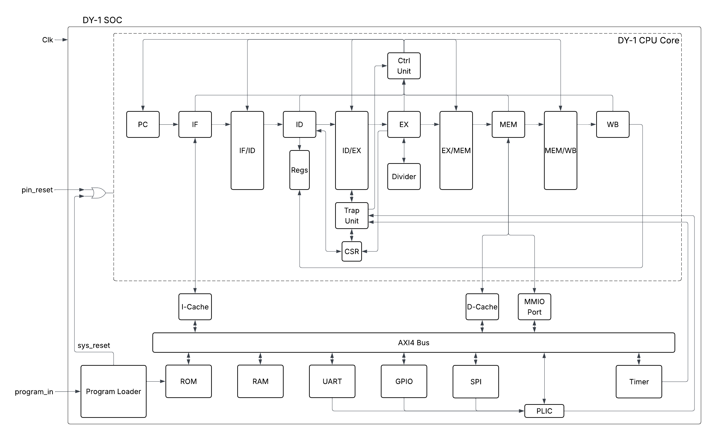

# DengYun-1 RISCV CPU
**DengYun-1** (**DY-1**) is a 32-bit RISC-V SoC written in Verilog, targeting FPGA deployment. The CPU core is a single-issue in-order 5-stage pipeline implementing RV32IM, backed by split L1 caches on an AXI4 interconnect. 

## Overview

## Features
- **RV32IMZicsr** — base integer, multiply/divide, and privileged CSR instructions
- **5-stage pipeline**
- **Split L1 caches** — 2 KB 4-way set-associative with PLRU on both I and D caches; D-cache is write-back / write-allocate with dirty eviction before refill; hits served combinationally
- **AXI4 interconnect**
- **Trap and interrupt handling** — `ecall`, `ebreak`, `mret`; machine-mode timer and external interrupts gated by `mstatus.MIE`

## Testing
### Building
`cd test/test_full && make`\
Requires `riscv-none-elf-gcc`. Output lands in `test/test_full/mem/`.
### Vivado xsim
1. Add `rtl/src/*.v` to source directory and `rtl/tb/soc_top_tb_full.sv` to simulation directory.
2. Add generated `.mem` files to simulation directory
3. Run simulation

## Deploying on FPGA
[Placeholder — zynq core bd tcl, project tcl, target board (tested: pynq-z2; plan: artix-7, kria kv260)]

## Performance
[Placeholder — Add after Coremark test]

## Timeline
1. AXI4 bus (priority arbiter with DMA stub) + connect masters/slaves (✓)
3. Full SoC, assembly tests passing with new bus/cache (✓)
4. UART, GPIO, CLINT timer (✓)
5. FPGA synthesis, timing closure, blink/uart hello world (✓)
6. Program loader
7. C toolchain bring-up, printf, basic programs
8. Running Coremark performance check
---
9. SPI/JTAG programmer; support in-system programming
10. DMA (software-managed flush + non-cacheable region)
11. Running RTOS
